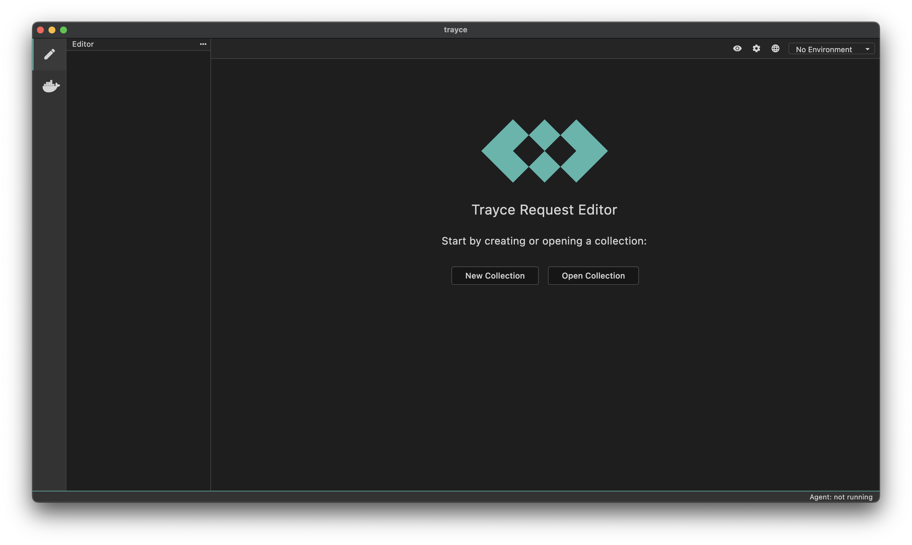

Trayce is a Git-friendly, offline-first, open-source API client and Docker network-monitor. It is born out of frustration with existing API clients which are all based on Electron, Tauri or other frameworks which use a web browser to render the user interface.

## Collection Format

Trayce collections follow the [bru-lang](https://docs.usebruno.com/bru-lang/overview) format and therefore are interoperable with the Bruno API client. You can open a Bruno collection with Trayce, and you can open a Trayce collection with Bruno. They are one and the same.

## Docker Network Monitor
 The Docker network monitor lets you see what requests are being made to, from and in-between your Docker containers. It differs from other developer proxy tools like Fiddler, HttpToolkit and Requestly in that it does not require the use of a proxy or setting up CA certificates to intercept TLS-encrypted messages. Instead it uses eBPF to intercept system calls at the kernel layer and propogates this information to the GUI.
