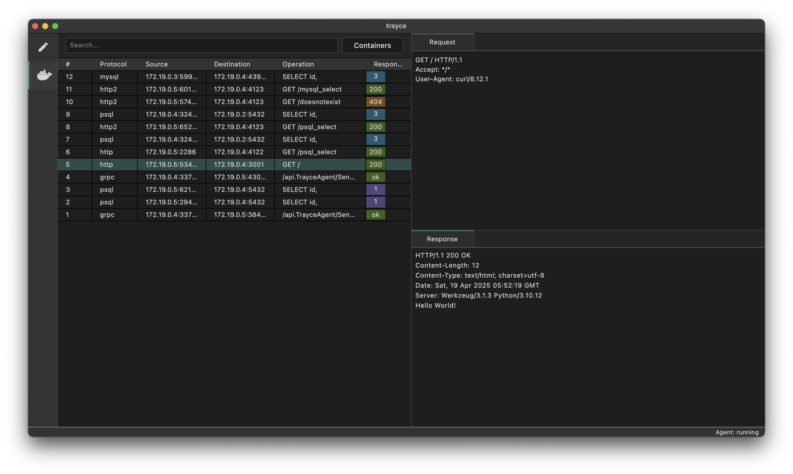

The Docker Network Monitor lets you monitor network traffic to, from and in-between your local Docker containers without the need for a proxy. It can read TLS-encrypted traffic without needing custom CA certificates or any changes to your containers. All you have to do is start the [TrayceAgent](https://hub.docker.com/r/traycer/trayce_agent) with a single command.

The supported protocols are:
- HTTP1.1
- HTTP2
- gRPC
- MySQL
- PostgreSQL
