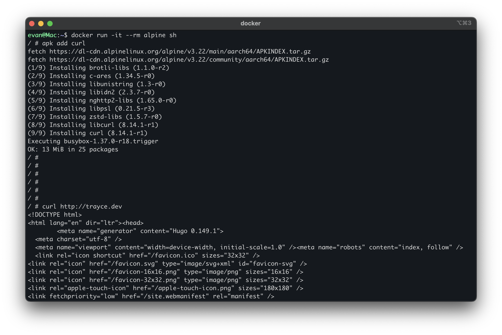
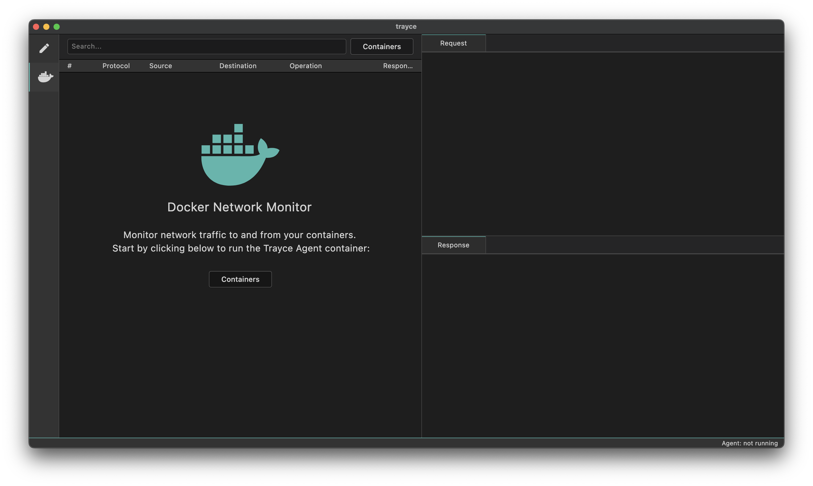
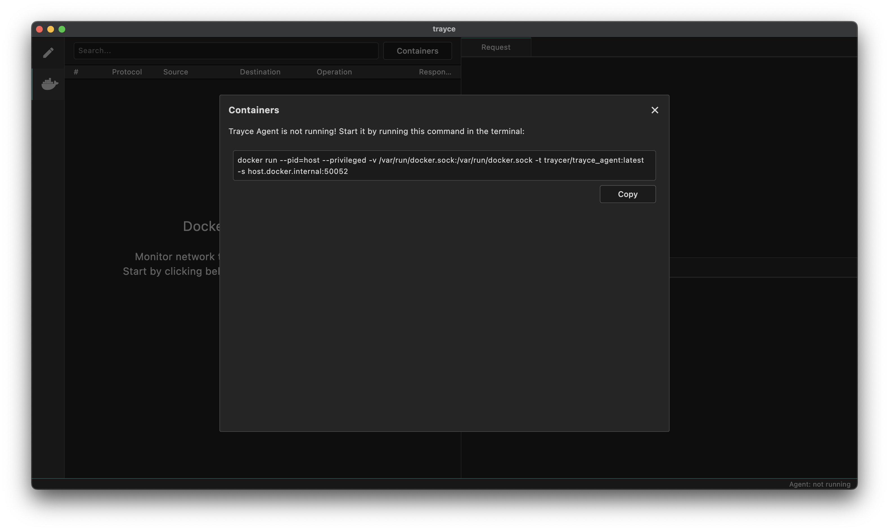
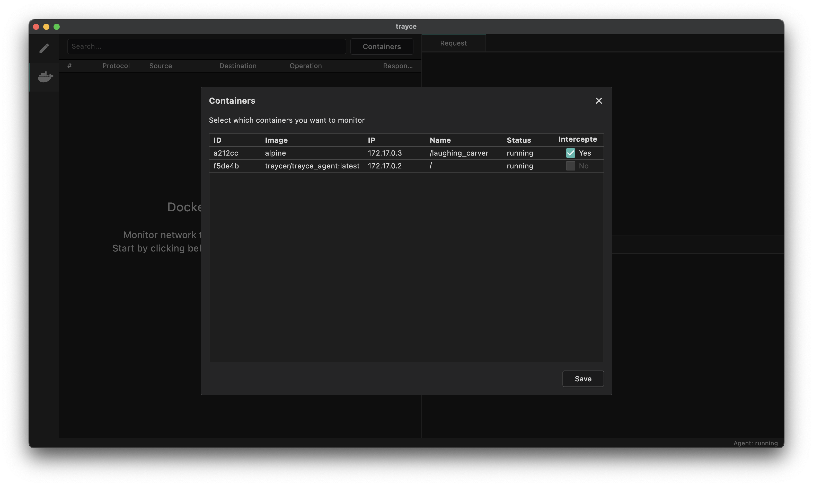
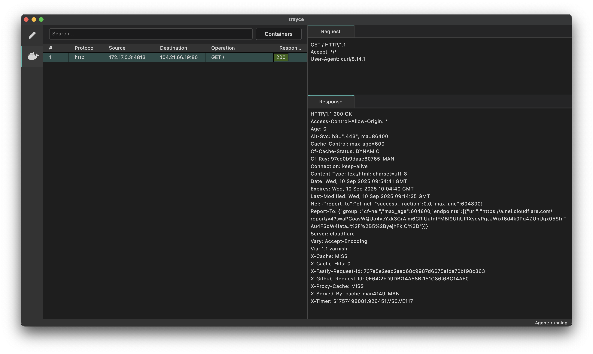

To get started, lets monitor a container, make an HTTP request from it and see that request appear in Trayce.

### 1. Start a Container

Lets start an alpine container and install curl on it:
```
docker run -it alpine sh
apk add curl
```

Verify it works by running `curl https://trayce.dev`:



### 2. Monitor the Container

Open Trayce, click on the Docker icon in the sidebar:

Click on the "Containers" button, copy the command and run it in a console window. This will start the TrayceAgent.


  If the containers you wish to monitor are not running on the default network, you will have to append a `--network` arg to the command.


Once the TrayceAgent has sucessfully started, the modal will change to a list of running containers. Check which container you want to monitor and click "Save". In our case we want to monitor the alpine container we started in step 1.


### 3. Make a Request

Go back to the shell console on the alpine container, and re-run `curl https://trayce.dev`, you should now see this request was picked up by Trayce and displayed in the GUI:


