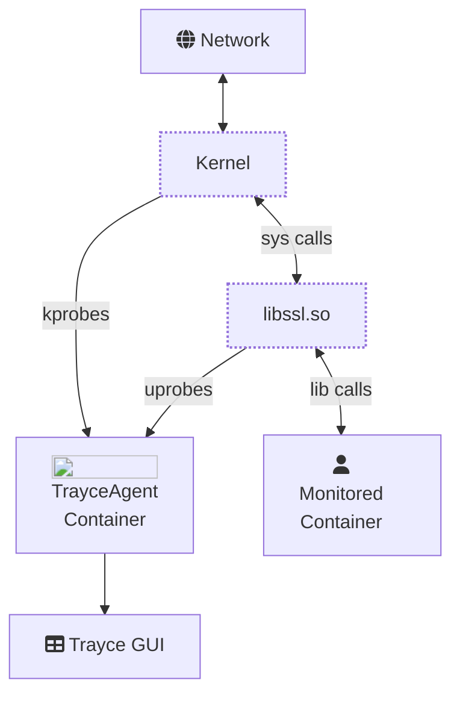

Trayce does not rely on a proxy to read network traffic, even if it's TLS-encrypted. Instead the [TrayceAgent](https://github.com/evanrolfe/trayce_agent) container is run on the same machine as the containers being monitored. It uses a combination of [eBPF](https://ebpf.io/what-is-ebpf/) kprobes and uprobes to read raw, unencrypted network traffic.

Raw byte streams of network traffic are sent from the kernel-space eBPF program, to a user-space program running in the agent container, which parses those streams into structured requests/responses. Which are then sent over gRPC to the GUI to be displayed to the user.

## kprobes

eBPF kprobes are programs which hook into Linux kernel functions. They get executed any time the kernel function is called, or returned from (kretprobes). TrayceAgent attaches kprobes to kernel functions which transfer data over sockets, e.g. [sendto](https://linux.die.net/man/3/sendto) and [recvfrom](https://linux.die.net/man/3/recvfrom). This allows us to read the raw bytes being sent and received over the network. Filtering is done on these calls to ensure we only capture TCP traffic from the containers we want to monitor.

## uprobes

eBPF uprobes are like kprobes except they hook into user-space programs. To intercept TLS-encrypted traffic, the TrayceAgent attaches uprobes to the OpenSSL library (i.e. `libssl.so.3`) and reads any calls made to `SSL_Write` or `SSL_Read`. This way it is able to see the raw, unencrypted traffic, before it is encrypted to be sent over the network, or read incoming traffic after it has been decrypted by OpenSSL.

For programs written in Go, the functions for encrypting and decrypting TLS traffic in Go's [crypto/tls](https://pkg.go.dev/crypto/tls) package are attached with uprobes in a similar way to how OpenSSL is done. This is because Go does not rely on OpenSSL for TLS encryption and instead comes with its own built-in package for encryption.

## user-space

The user-space part of the TrayceAgent is a program written in Go which receives the raw byte stream of network traffic, sent over a BPF [ring-buffer map](https://www.kernel.org/doc/html/next/bpf/ringbuf.html) from the kprobes and uprobes mentioned above. The byte streams are segmented by TCP connection and an algorithm is run over the byte stream to detect which protocol is being used. If a supported protocol is detected, then it starts parsing the byte stream into request and response structs. Those structs are then sent over gRPC to the GUI to be displayed to the user.

For more in-depth documentation on the TrayceAgent, see the [docs](https://github.com/evanrolfe/trayce_agent/tree/main/docs) in its Github repo.
