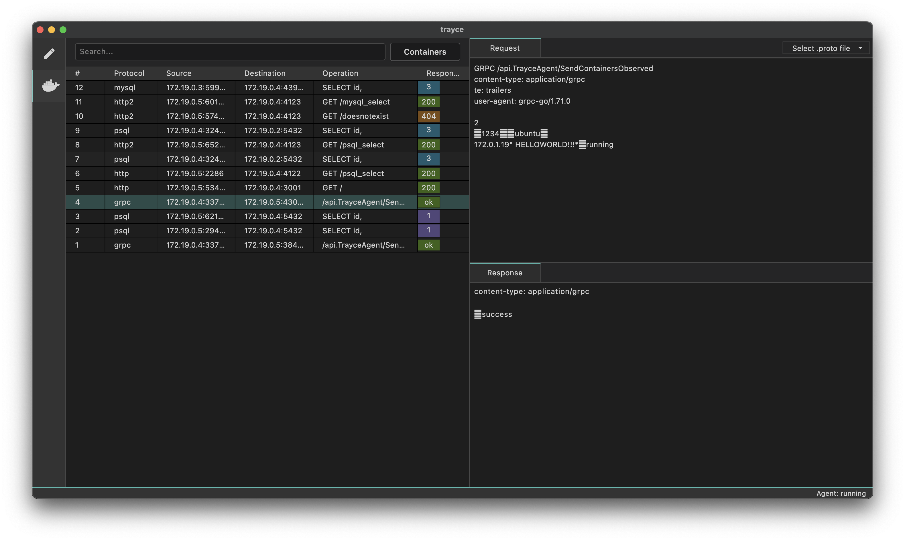
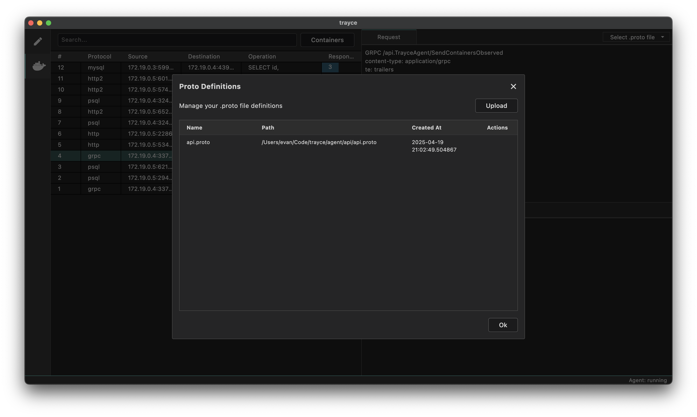
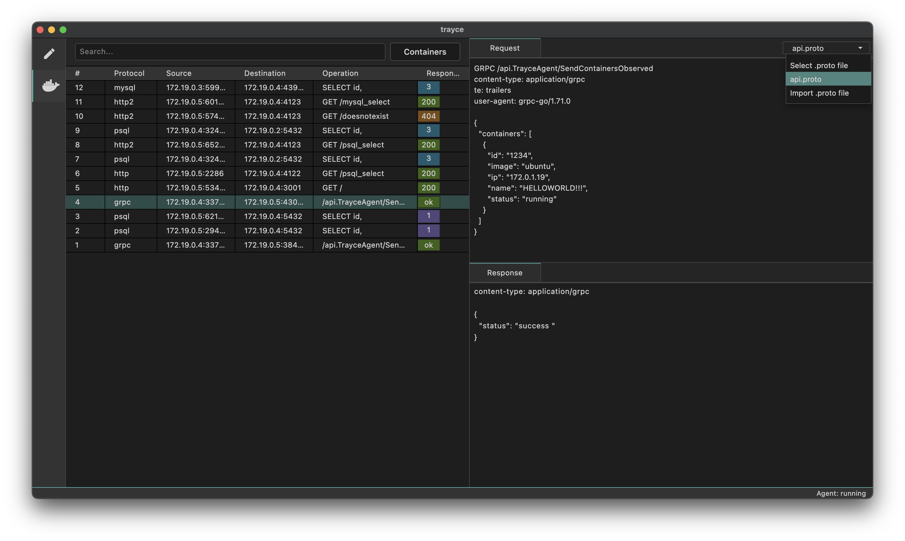

Trayce can monitor HTTP and HTTP-based protocols, including HTTP1.1, HTTP2 and gRPC.

## HTTP

## gRPC

gRPC messages will initially appear with their raw data:

To parse the messages and properly display them, you must import the `.proto` file for the API in use. Do this by click the "Select .proto file" dropdown in the top right corner, and clicking "Import .proto file". Click "Upload" and browse to the file in your machine.

You can now select the `.proto` file from the dropdown, and the message will be parsed and displayed in a readable format:

