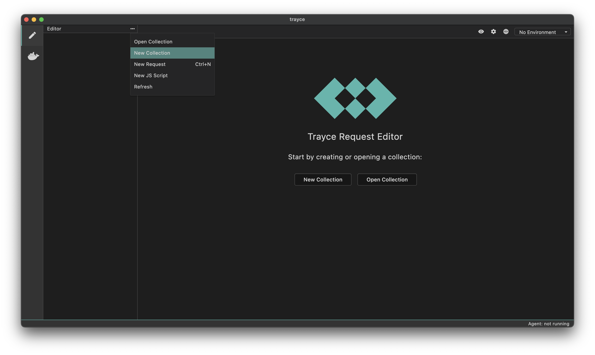
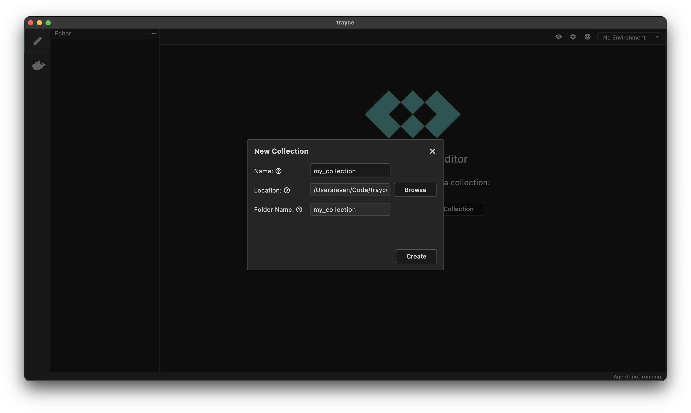

A collection in Trayce is a structured group of API requests, tests, and related resources that helps you organize and manage your API testing workflow.

## How to Create a Collection

1. Open Trayce
2. Click on the `...` button and select `Create Collection` from the dropdown (or click "New Collection" below the Trayce logo)

3. Enter a name for your collection
4. Choose a location on your filesystem to store the collection

5. Click **Create**

Congratulations! You have successfully created your first collection.
