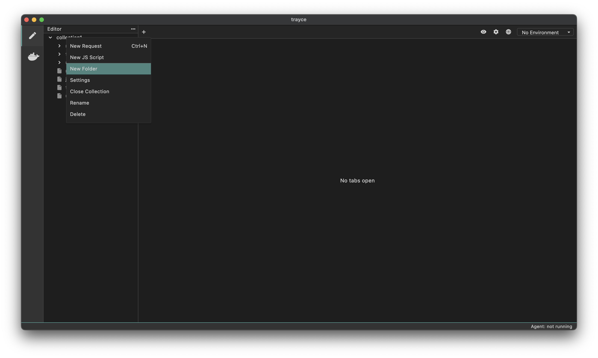
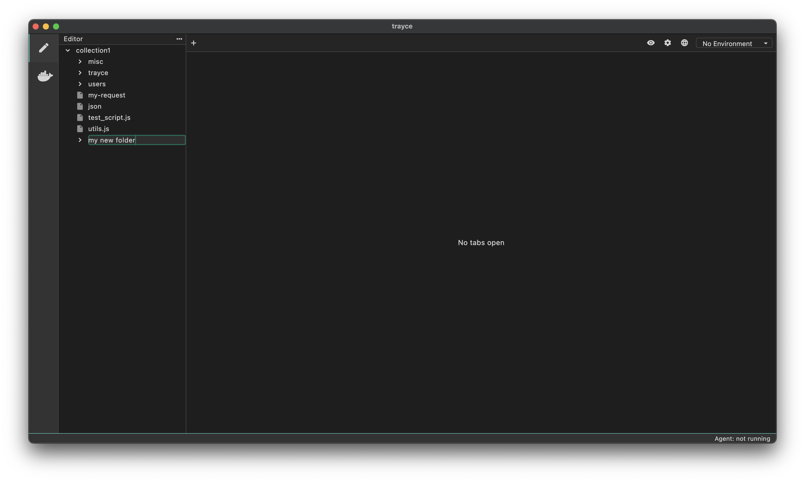

Trayce helps you organize your API requests efficiently by grouping them into folders. You can create a structured hierarchy that matches your API's organization, making it easier to manage and navigate your collections.

## How to Create a Folder

1. Right-click your collection from the file explorer
2. Select `New Folder` from the menu

3. Type a name for your folder and hit Enter

