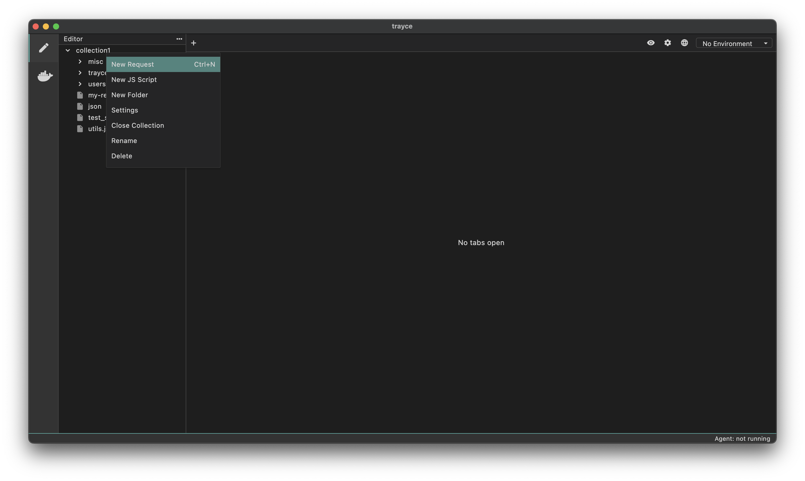
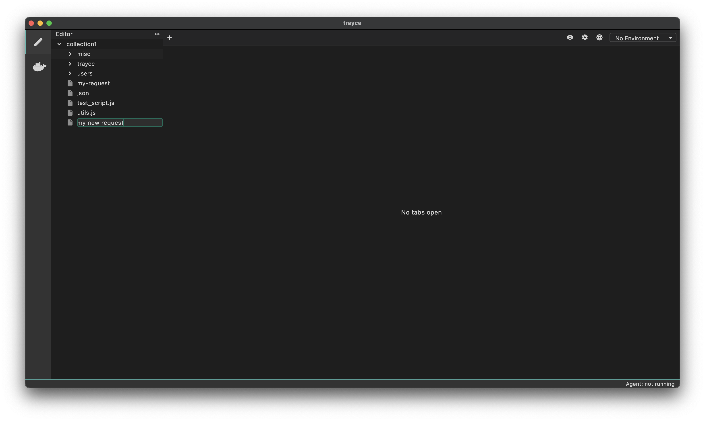

A request is the primary object in Trayce. Let's walk through how to create your first request:

## How to Create a Request

1. Right-click your collection from the file explorer
2. Select `New Request` from the menu (or press `Ctrl+N` on your keyboard)

3. Type a name for your request and hit Enter

You have successfully created your first request in Trayce! Feel free to add headers, query parameters, and a request body to your request, or play around with the other options available.

