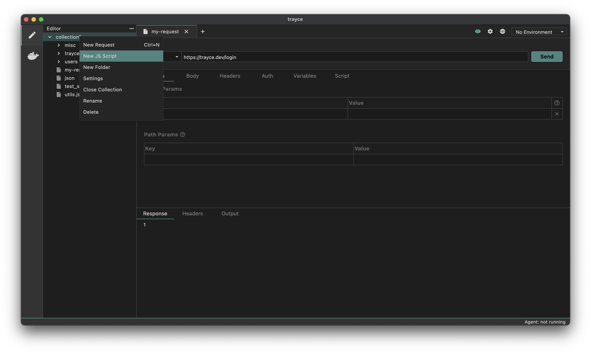
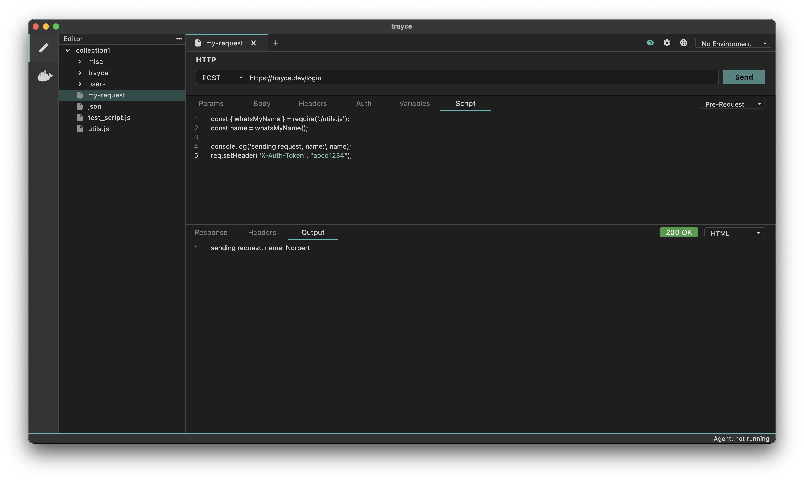

Trayce provides the ability to create JavaScript files where you can modularize common code and reuse code across different requests or collections.

This can be especially helpful in complex scripting scenarios where the same test will be run across multiple requests, or you're looking to leverage data that lays outside of Trayce.

## How to Add a Script

You can generate a JS File by:

1. Right click collection or folder
2. Select `New JS Script` from dropdown.



3. Type the name and hit enter, your code editor will open with that file


The default code editor in Tryace is VSCode. To change this click **File -> Settings -> Editor** and modify the **Code editor command** value.


## How to Use a Script

Once your JS File has been created, you can now import the functions into any `Script` tab across your resources. For example if we create a script called `utils.js` with this content:
```js
const f = require('faker');

function whatsMyName() {
  return f.name.firstName();
}

module.exports = {
  whatsMyName,
};
```

Then add a pre-request script:
```js
const { whatsMyName } = require('./utils.js');
const name = whatsMyName();

console.log("sending request, name:", name);
req.setHeader('X-Auth-Token', 'abcd1234');
```

When the request is sent, the console output will show the results of the script:


