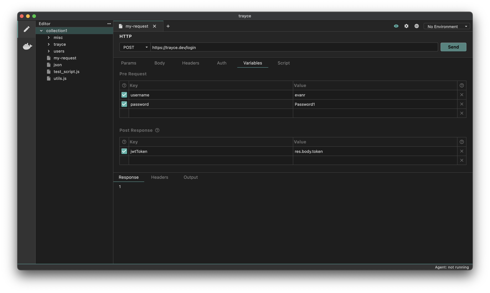

The **Variables** tab allows you to manage variables at different stages of your request lifecycle. You can set and use variables:
- Before the request (Pre Request)
- After receiving the response (Post Response)


  Variables are scoped within the request and cannot be accessed outside of it. This ensures clean separation between different requests.


## Pre Request Vars

In the **Variables** tab, select the **Pre Request** option from the dropdown, you can write any strings, numbers or any valid JavaScript literal.

## Post Response Vars

In the **Variables** tab, select the **Post Response** option from the dropdown, you can write any valid JavaScript expression. The `res` object is available, allowing you to declaratively parse the response object and set variables, instead of writing scripts to do the same.

For parsing the response, you can checkout the [response query](../response-query) that allows you to easily query your response.

