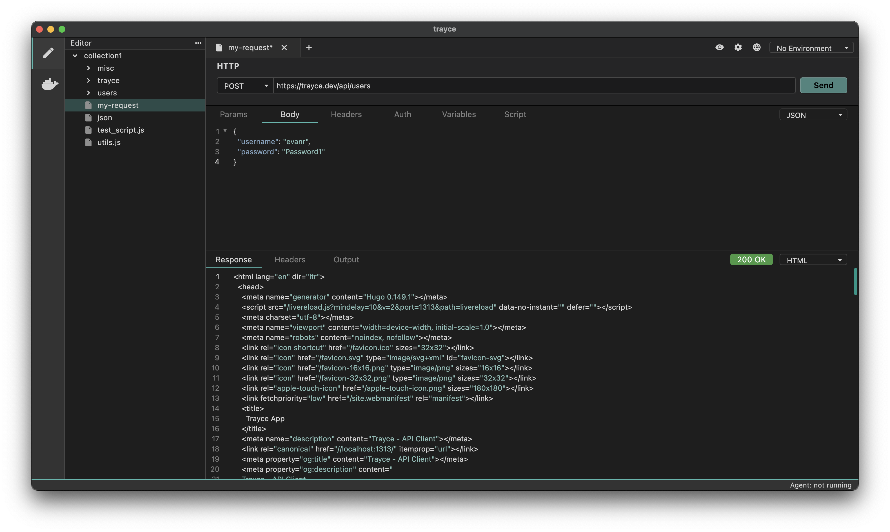
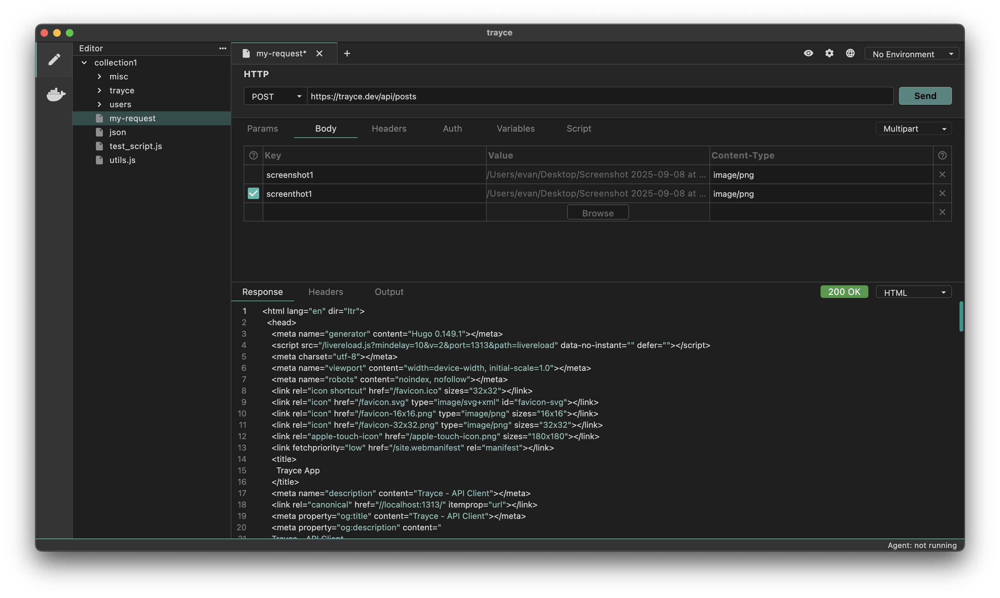
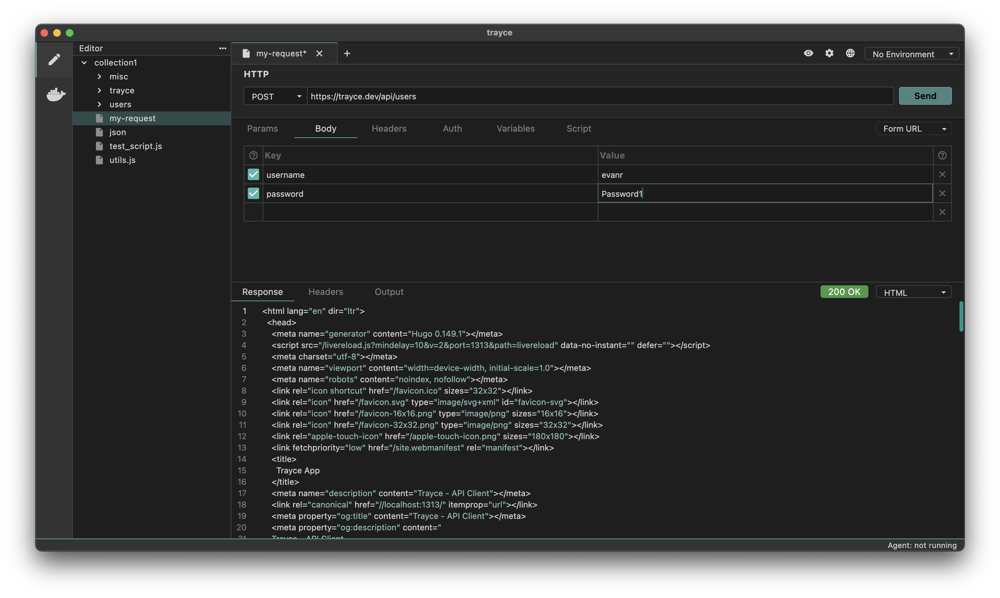
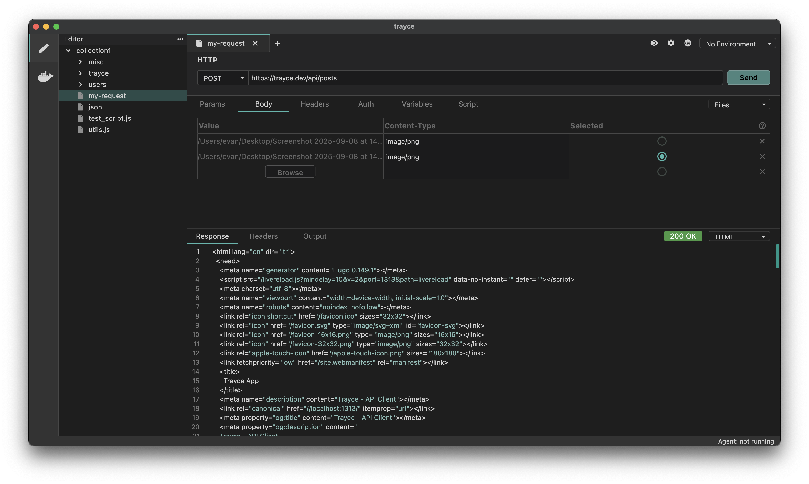

The Body tab allows you to send specific data with your API requests. You can choose from various data formats, such as Form, Raw, and others, using the dropdown menu.

## How Send API Requests with a Body

You can select the data type based on your API request requirements. For example, if you’re working with a request where you need to send specific details about a particular item, you’ll likely choose JSON as the data type and include the data in the body of the request.

### 1. Text-Based Data

Text-based data allows you to send data in its raw, unprocessed form in the body of an API request. It doesn’t require a predefined structure like key-value pairs or multi-part boundaries. Instead, you can send data exactly as it is, which is useful when dealing with structured data formats such as JSON, XML or plain text.

1. Navigate to the Body tab.
2. Select your preferred data format (i.e. JSON).
3. Add appropriate data for your API request.
4. Save and execute the request.

### 2. Form Data

**Multipart Form**

Multipart form data is used for sending files along with form data, allowing multiple parts with different content types in a single request. In multipart form data, each part of the request is separated by a boundary.

1. Navigate to the Body tab.
2. Select Multipart Form from dropdown.
3. Click on Add File and upload your file.
4. Save and execute the request.

**URL-Encoded Form**

URL-Encoded form data is commonly used for simple form submissions where data is sent as key-value pairs. Each key and value are separated by an equal sign (=), and multiple pairs are separated by an ampersand (&).

1. Navigate to the Body tab.
2. Select Form URL Encoded from dropdown.
3. Click on Add Param and add key-value pair.
4. Save and execute the request.

### 3. File Data

File data allows you to upload and send files directly in the body of your API request. This is commonly used for uploading documents, images, or any binary data to endpoints that accept file uploads. The file is sent as raw binary data in the request body.

1. Navigate to the Body tab.
2. Select File from dropdown.
3. Click Browse to upload a file.
4. Click the file's radio button to select it to be sent
5. Save and execute the request.

