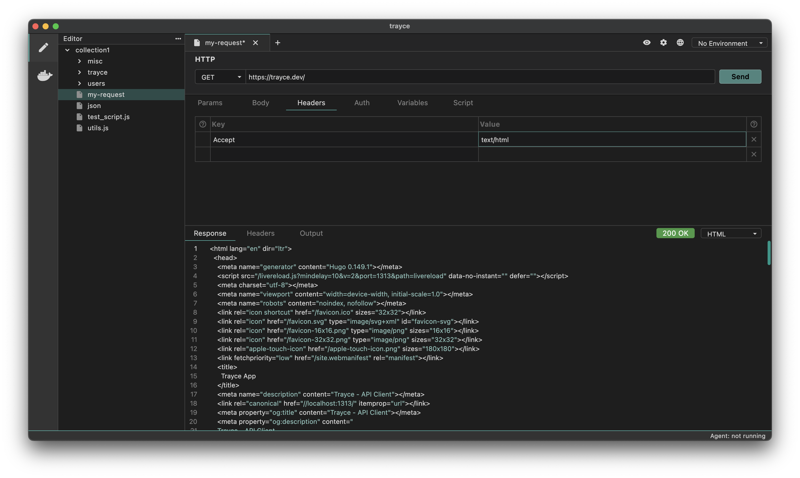

Request headers are key-value pairs sent along with an HTTP request to provide additional information to the server about the request. The request headers give the server more information about how to process the incoming request.

**Default Headers:** Default headers are predefined headers that are part of the HTTP specification.

**Custom Headers:** Custom headers are headers that are user-defined and are not part of the official HTTP specification.

## How to Add Request Headers

1. Create a request
2. Navigate to the Headers tab
3. Enter the Name of the header and its corresponding Value.

