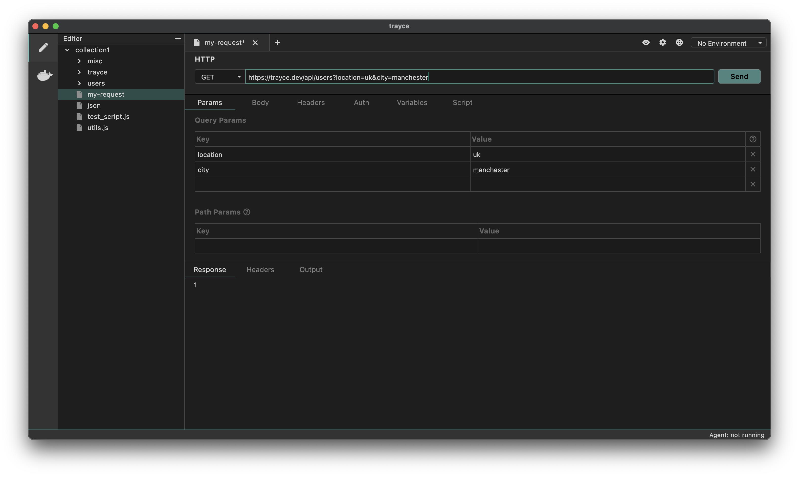
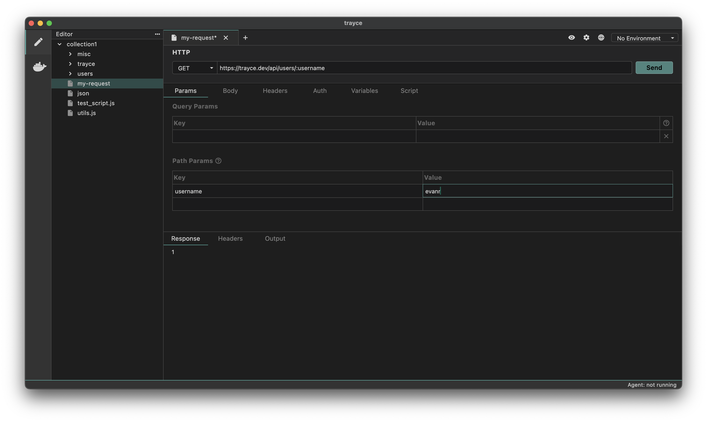

Trayce enables you to send data with your HTTP requests. You can include both query and path parameters in the request and define their corresponding values.

1. Query Parameters
2. Path Parameters

## Query Parameters

Query parameters are a way to pass additional information to a server via the URL when making an HTTP request. They are commonly used in GET requests to filter, sort, or specify the data you’re asking for.

### How Query Parameters Work
- Query parameters are appended to the end of the URL after a ? symbol
- Each parameter consists of a key-value pair
- If there are multiple query parameters, they are separated by an & symbol

### How to Add Query Parameters

1. Create a request
2. Navigate to the Params tab
3. Enter the Name of the parameter and its corresponding Value



You’ll notice that the values are appended to the URL, starting with a ?.

## Path Parameters

A path parameter is a dynamic value embedded directly in the URL path of an API request. It is used to specify particular resources or data points within an API endpoint.

### How Path Parameters Work
- Path parameters are embedded directly in the URL path.
- They are represented as placeholders preceded by a colon (:).
- When making the request, the placeholder is replaced with a dynamic value, which is part of the URL.

**Example:**
```
https://api.example.com/users/:id
```

`:id` is a path parameter.

### How to Add Path Parameters

1. Create a request
2. Navigate to the Params tab
3. Add the path parameter variable in the URL. e.g. `/users/:user`
4. Enter the value in the path parameter section for the corresponding variable.


