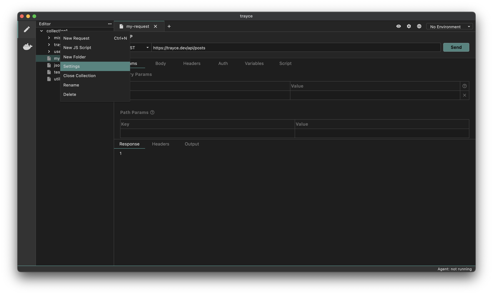
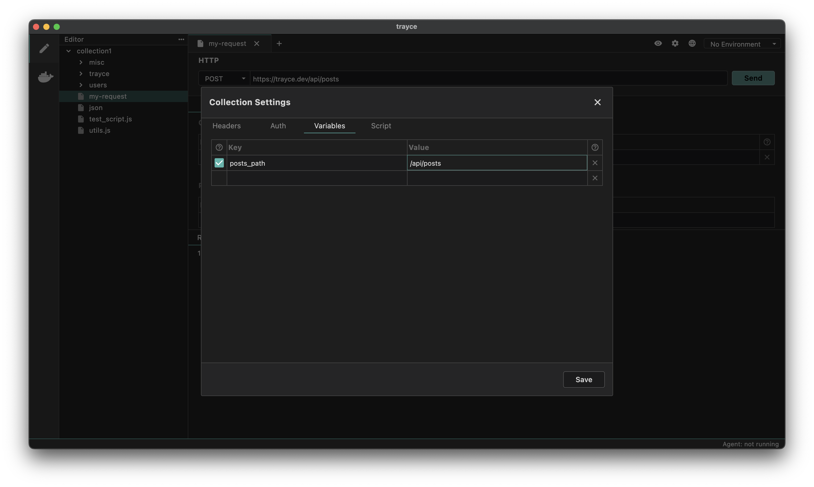
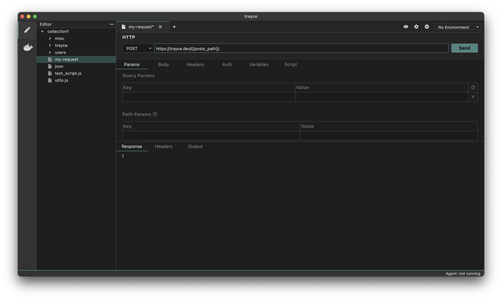

Collection variables are variables that are scoped to a specific collection. They are useful for storing variables that are used across multiple requests in a collection.

## How to Add a Collection Variable
1. Go to Collection Settings



2. Go to the Variables tab
3. Add your variable name, value in the Pre Request Vars section
4. Save your changes



## Using a Collection Variable
You can use the `{{varName}}` syntax to use a collection variable in a request.



#### Access Collection Variable inside scripts
You can also use the `bru.getCollectionVar()` function to get the value of a runtime variable and use it inside your pre request scripts.

```javascript
let namespace = bru.getCollectionVar("posts_path");
```
