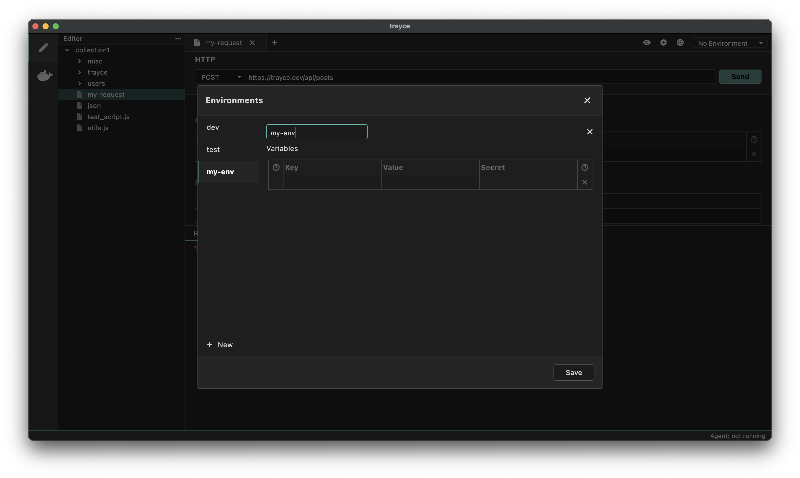
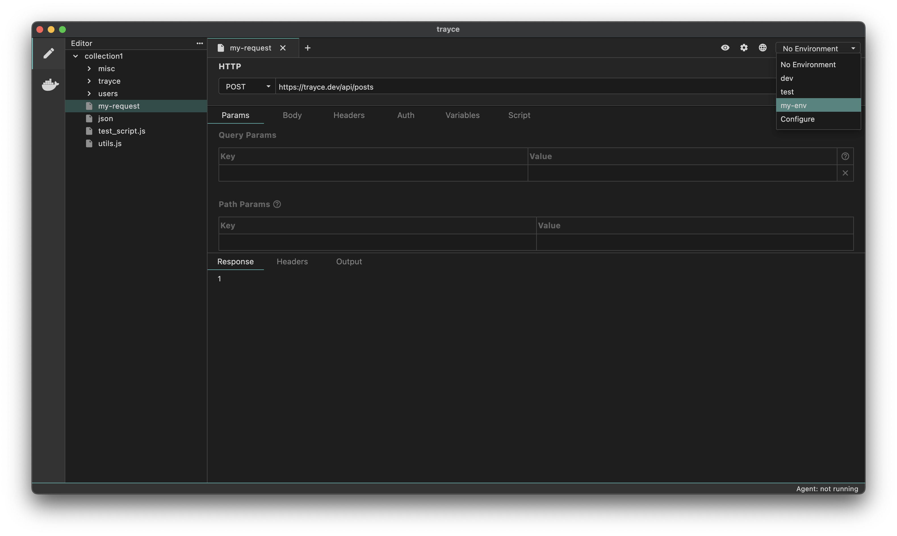

Environment variables are variables that are scoped to an environment, such as local development or production. They are useful for storing variables that can be re-used across the collection that are different depending on the environment. An example would be the host url of the server you want to test.

# How to Add an Environment Variable

1. Go to environments (top right) and press configure.
2. If there are no environments, you will be prompted to create one.
3. Add your variable name and value for the specific environment.
4. Save your changes.



Select the environment from the dropdown:


## Using an Environment Variable

Just like other variables you can use the `{{varName}}` syntax to use an environment variable in a request. On the top-right, you can see which environment you are currently using and select a different one.

## Using the ./environment Directory

Environment variables are synced with the `/environments` directory inside your collection. You can also create and manage environments there.

Each environment is saved in a `<environment-name>.bru` file, which looks like this:

```bash
vars {
  host: http://localhost:8787
}

vars:secret [
  my_password
]
```
