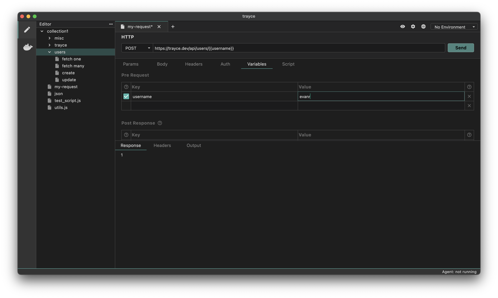

Folder variables are variables that are scoped to a specific folder. They are useful for storing variables that are used across multiple requests in a folder.

## How to Add a Folder Variable
1. Go to Folder Settings


2. Go to Vars Tab
3. Add your variable name, value in the Pre Request Vars section
4. Save your changes


## Using a Folder Variable
You can use the `{{varName}}` syntax to use a folder variable in a request.



#### Access Folder Variable inside scripts
You can also use the `bru.getFolderVar()` function to get the value of a folder variable and use it inside your scripts.

```javascript
let bearerToken = bru.getFolderVar("username");
```
