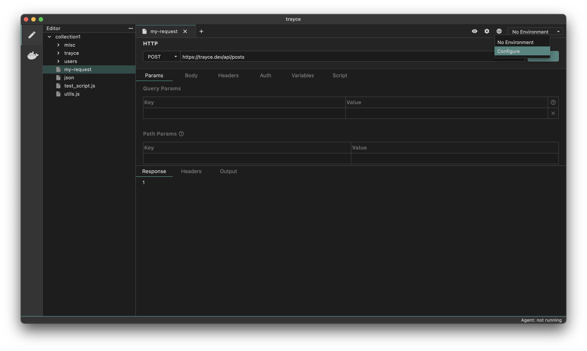
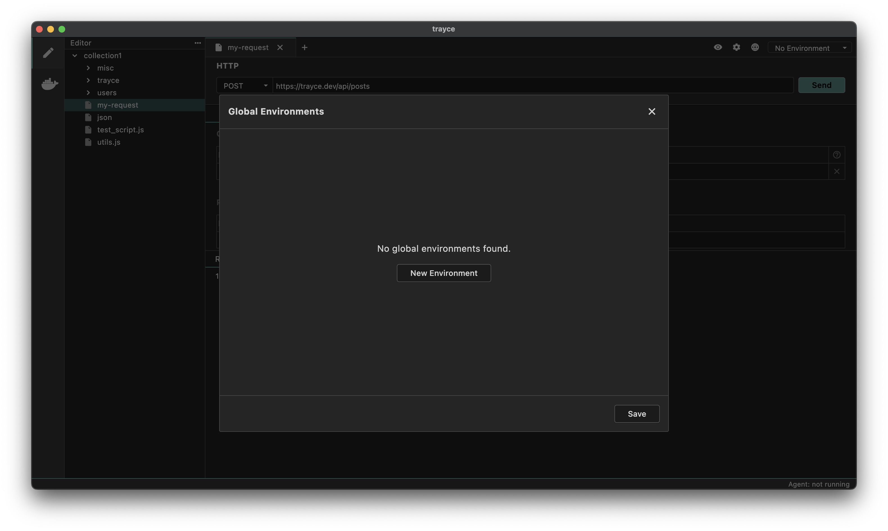
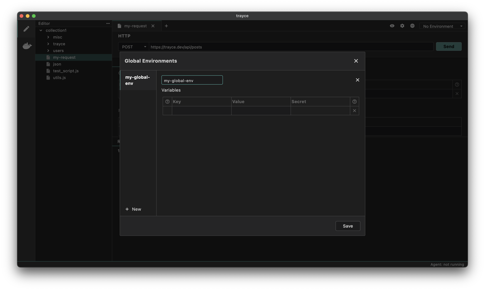


Global variables are stored in the application's memory. You can access them by visiting the About section from Settings and navigating to the AppData path location.


Global environment variables can be used across all collections and requests. Think of them as a global store accessible throughout the app.

Instead of creating the same collection variable repeatedly in each collection, you can use global variables to store common values that need to be accessed across different collections. This eliminates the repetitive task of defining the same variables every time.

## How to Add a Global Environment Variable

1. Click the Global Environments icon (top right corner) and click Configure.

2. Click **New Environment**.

3. Click the edit icon next to the environments name, enter your name and hit enter. Add variables by typing their name and value:

Your global environment variable is now created and can be accessed across your workspace.


You can click the secret checkbox to hide the values of variables while hovering over them.


## How to use Global Environment Variables

To use a global environment variable, reference it using the format `{{var_name}}` in any request or collection. These variables can be combined with other variables and used throughout your workspace, making them ideal for consistent value sharing.

