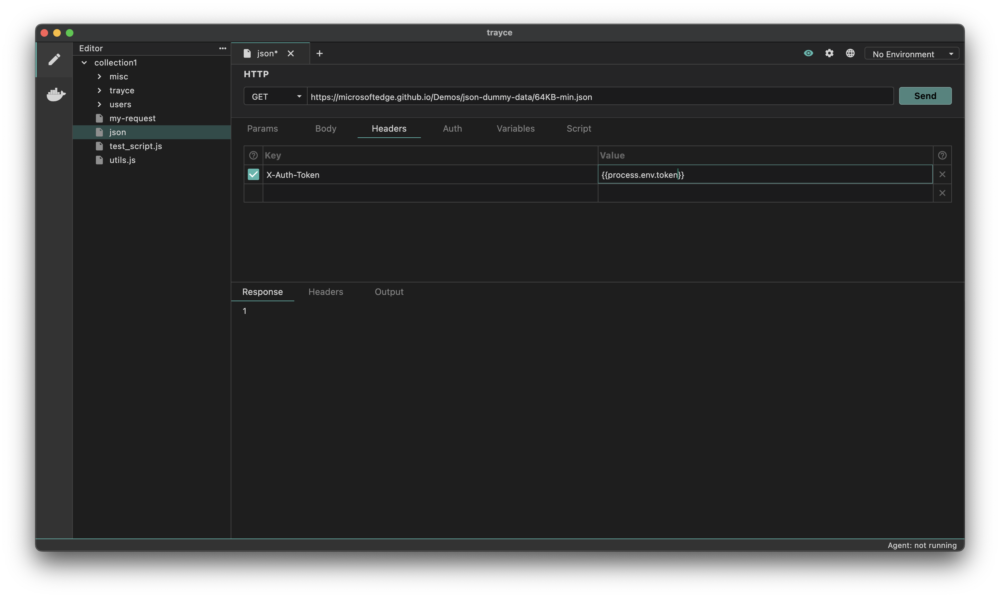

Process environment variables are used to store sensitive information, such as API keys, passwords, and other secret values. These values are stored in a `.env` file.


  You must create the `.env` file in your local project directory (e.g., using
  VS Code) to store your process environment variables. Trayce cannot create or
  manage the `.env` file for you.


### Creating a Process Environment Variables

To create process environment variables, you can add a `.env` file to the root of your collection. This file will store your secrets, which can then be accessed throughout the collection.

#### Example

In your collection, the structure might look like this:


  
    
    
    
      
    
    
  
  
  
  
  


In the `.env` file, you would store a key-value pair, like this:

```bash showLineNumbers filename=".env"
key = 1232abcd
```

### Using the Process Environment Variables

To access the values stored in the `.env` file, you can use the `process.env` global object. For example, if you want to retrieve the key value from your `.env` file, you would use:



You can use `process.env.<secret-name>` throughout your collection to securely manage and access your environment variables.
