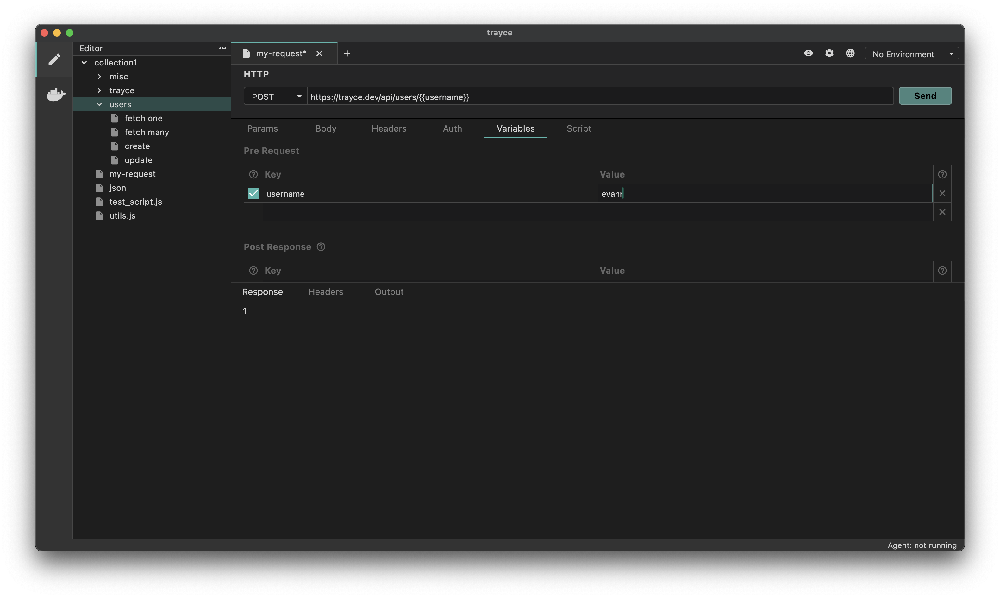

Request variables are variables that are scoped to a specific request. They are useful for storing variables that is used in a specific request.

## How to Add a Request Variable
1. Go to the Request
2. Go to Vars Tab
3. Add your variable name, value in the Pre Request Vars section
4.  Save your changes



## Using a Request Variable
You can use the `{{varName}}` syntax to use a request variable in a request.

#### Access Request Variable inside scripts
You can also use the `bru.getRequestVar()` function to get the value of a request variable and use it inside your scripts.

```javascript
let source = bru.getRequestVar("source");
let destination = bru.getRequestVar("destination");
```
